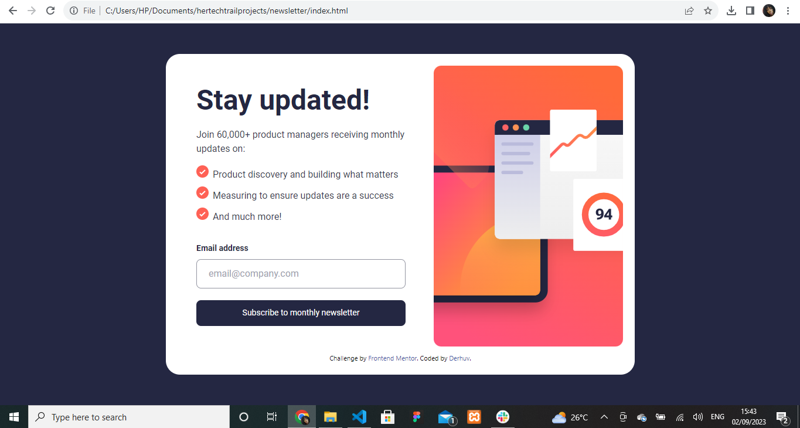
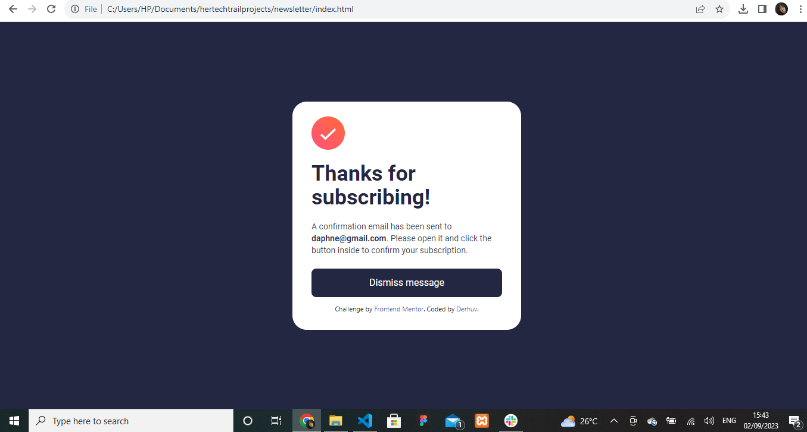
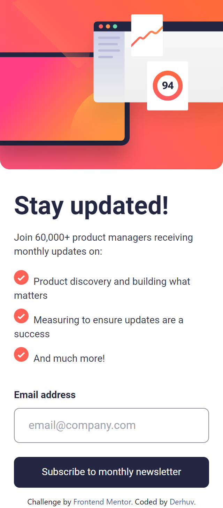
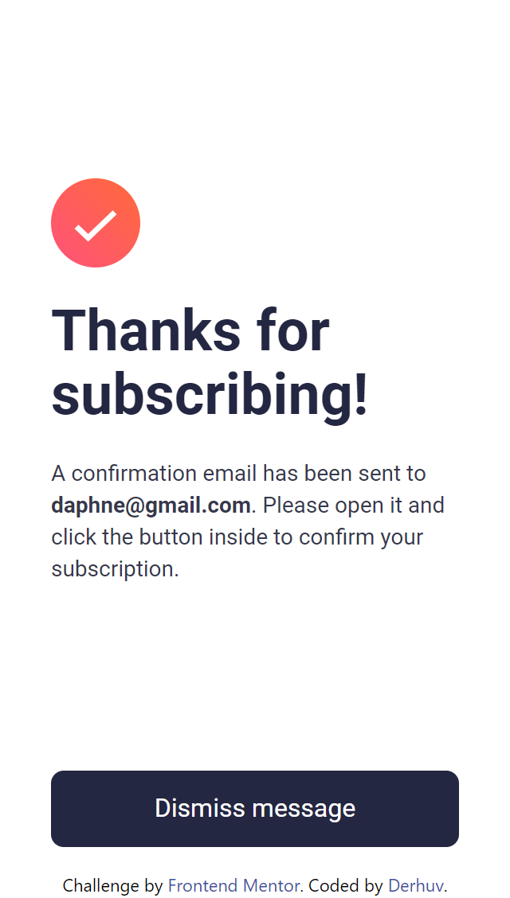

# Frontend Mentor - Newsletter sign-up form with success message solution

This is a solution to the [Newsletter sign-up form with success message challenge on Frontend Mentor](https://www.frontendmentor.io/challenges/newsletter-signup-form-with-success-message-3FC1AZbNrv). Frontend Mentor challenges help you improve your coding skills by building realistic projects. 

## Table of contents

- [Overview](#overview)
  - [The challenge](#the-challenge)
  - [Screenshot](#screenshot)
  - [Links](#links)
- [My process](#my-process)
  - [Built with](#built-with)
  - [What I learned](#what-i-learned)
  - [Useful resources](#useful-resources)
- [Author](#author)

## Overview

### The challenge

Users should be able to:

- Add their email and submit the form
- See a success message with their email after successfully submitting the form
- See form validation messages if:
  - The field is left empty
  - The email address is not formatted correctly
- View the optimal layout for the interface depending on their device's screen size
- See hover and focus states for all interactive elements on the page

### Screenshot

### Links

- Solution URL: [Github repo](https://github.com/derhuv/newsletter)
- Live Site URL: [live site](https://derhuv.github.io/newsletter/)

## My process

### Built with

- Semantic HTML5 markup
- CSS custom properties
- Javascript
- Mobile-first workflow
- [Tailwindcss](https://tailwindcss.com/)

### What I learned
I improved my knowledge on tailwindcss

I explored breakpoints to ensure a seamless user experience across different devices.

I learnt how to use regular expressions in javascript

### Useful resources

- [Tailwind documentation](https://tailwindcss.com/docs/installation) - This helped me learn about different tailwind classes

## Author

- Website - [Derhuv](https://github.com/derhuv)
- Frontend Mentor - [@derhuv](https://www.frontendmentor.io/profile/derhuv)
